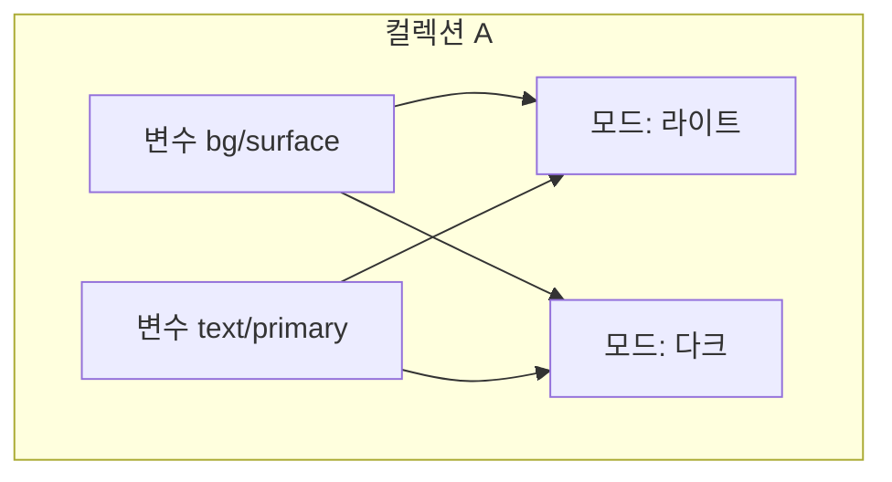

# Figma 디자인 토큰·변수 구조 요약

대상 파일: [🔥 MVP 기획 (Copy)](https://www.figma.com/design/MDkBwj1k2oBpMpZnhD4lhJ/%F0%9F%94%A5.-MVP-%EA%B8%B0%ED%9A%8D--Copy-?node-id=1415-24724&t=fsK18kgTOIALLl7V-1)  
파일 키: `MDkBwj1k2oBpMpZnhD4lhJ` · URL 기준 노드 ID: `1415:24724` → API·MCP에서는 `1415:24724` 형식으로 지정

이 문서는 위 Figma 파일에 **정의·입력할 수 있는 변수(Variable)**와 **컬렉션(Collection)**의 관계를 중심으로, 디자인 토큰을 어떻게 나누고 연결할지에 대한 요약입니다. Figma Learn의 [변수·컬렉션·모드 개요](https://help.figma.com/hc/en-us/articles/14506821864087-Overview-of-variables-collections-and-modes)와 플러그인 API에서의 동작 모델을 기준으로 정리했습니다.

**MCP 보강:** Figma Desktop MCP의 `get_variable_defs`로, 위 노드가 포함하는 화면(또는 해당 서브트리)에서 **참조되는 변수들의 이름과 해석된 값**을 한 번 수집해 반영했습니다. MCP는 **컬렉션 이름·모드 ID·변수가 속한 컬렉션**을 내려주지 않으므로, 아래 “이 파일에서 관찰된 네이밍”은 **논리적 그룹 추정**이며, 실제 컬렉션 경계는 Figma **Variables 패널**에서 확인해야 합니다. MCP 재실행 시 **디자인 파일이 Cursor 연동 Figma의 활성 탭**이어야 합니다.

---

## 1. MCP로 본 이 파일의 변수 맵(요약)

### 1.1 수집 조건과 한계

- **도구:** `get_variable_defs`
- **노드:** `1415:24724` (사용자가 공유한 URL의 `node-id`)
- **결과 형태:** `{ "토큰이름": "해석된 값" }` 형태의 평면 맵. 색·숫자·문자는 HEX/숫자/문자열로 풀리고, **복합 타입 스타일**은 `Font(...)`·`Effect(...)` 문자열로 요약됨.
- **포함되지 않는 정보:** 변수가 속한 **컬렉션**, **모드별 값 테이블**, **에일리어스 그래프**(다만 `Font` 요약 안에 다른 토큰 이름이 문자열로 남는 경우는 있음).

### 1.2 규모

- 동일 조건으로 수집된 키 개수는 **약 170개 전후**(노드 범위·바인딩에 따라 달라질 수 있음).

### 1.3 이름 접두어로 본 논리 그룹 (컬렉션 추정용)

실제 Figma에서는 아래 각 그룹이 **한 컬렉션**에 모여 있을 수도, **여러 컬렉션**으로 나뉘어 있을 수도 있습니다. 다만 **변수 ↔ 컬렉션**의 연결 규칙은 변하지 않습니다: **변수 1개당 소속 컬렉션 1개**, **모드는 컬렉션에 귀속**.

| 논리 그룹(접두 경로) | 역할 | 이 파일에서 보이는 예시 |
|----------------------|------|-------------------------|
| `gray/`, `red/`, `yellow/`, `blue/` | 브랜드·UI **프리미티브 팔레트**(단계 스케일) | `gray/500`, `blue/500`, `red/600` 등 |
| `alpha/` | **투명도**가 있는 흑·백 오버레이 | `alpha/black/800`, `alpha/white/200` 등 |
| `content/` | 콘텐츠(텍스트·아이콘 등) **시맨틱 색** | `content/primary`, `content/highEmphasis1` 등 |
| `border/` | 테두리 **시맨틱** | `border/primary`, `border/mediumEmphasis1` 등 |
| `background/` | 배경 **시맨틱** | `background/default`, `background/inverse1` 등 |
| `surface/` | 면·상태 **시맨틱** | `surface/elevation1`, `surface/primaryBlur1` 등 |
| `colors/light/`, `colors/dark/` | **테마를 이름에 넣은** 별도 토큰 | `colors/dark/background`, `colors/light/borderLine` 등 |
| `light/…`, `dark/…` | 그라데이션 등 **자리 표시**(값이 비어 있는 키도 있음) | `light/content/gradient`, `dark/surface/gradient` 등 |
| `size/`, `line-height/`, `weight/` | 타이포 **원시 숫자·두께** | `size/500`, `line-height/800`, `weight/bold` |
| `font`, `font-family/` | 글꼴 **문자열** | `font`, `font-family/default` |
| `title/`, `body/`, `caption/` | **타이포 토큰(복합)** — 내부에서 위 변수를 참조 | `title/large`, `body/medium`, `caption/small` 등 |
| `typography/` | 프로젝트 특화 단일 스타일 | `typography/pMediumKr` |
| `spacing/`, `radius/` | 간격·모서리 **숫자 토큰** | `spacing/100`, `radius/200` |
| `elevation/` | 그림자 등 **이펙트**(변수로 표현된 요약) | `elevation/light/1`, `elevation/gradientStrong` 등 |

### 1.4 변수 ↔ 컬렉션 연결을 읽을 때 주의할 점 (이 파일 기준)

1. **모드 vs 이름으로 테마 나누기**  
   공식 모델에서는 **한 변수**가 **컬렉션의 모드**(예: Light / Dark)마다 다른 값을 가질 수 있습니다. 이 파일에는 동시에 `colors/light/…`, `colors/dark/…`처럼 **테마를 토큰 이름에 넣은 축**이 보입니다. 이는 **“컬렉션 하나 + 모드 두 개”**가 아니라 **“이름이 다른 변수 세트”**로 테마를 표현하는 패턴일 수 있으므로, **토큰을 추가할 때** 기존 규칙(모드 기반 vs 이름 분기)을 깨지 않도록 맞추는 것이 좋습니다.

2. **에일리어스(변수 → 변수)**  
   `title/large` 등의 값이 `Font(family: "font-family/default", …, size: size/800, …)` 형태로 나오면, 실제 파일에서는 해당 필드가 **다른 변수를 참조**하고 있을 가능성이 큽니다. 즉 **연결 지점**은 “컬렉션 소속”과 별도로, **값 정의 안의 VARIABLE_ALIAS**에 또 한 번 존재합니다.

3. **오타·이중 표기**  
   수집 맵에 `content/highEmphsis2`처럼 철자가 어긋난 이름이 보이면, 시맨틱 토큰 명명 일관성 점검 대상입니다. `weight/semi-bold`와 `weight/semibold`처럼 **같은 의미의 이중 키**가 있으면, 핸드오프·코드 매핑 시 혼선을 줄이기 위해 정리를 검토할 수 있습니다.

---

## 2. 핵심 한 줄

**모든 변수는 반드시 하나의 컬렉션에 속하며, “모드(테마·언어·디바이스 등)”는 컬렉션 단위로만 존재합니다.** 변수는 컬렉션 없이 단독으로 만들 수 없고, 값은 “어느 모드에서 무엇인지”가 컬렉션의 모드 목록과 짝을 이룹니다.

---

## 3. 변수와 컬렉션의 연결 지점 (가장 중요)

아래는 Figma에서 데이터가 어떻게 묶이는지에 대한 관계입니다. **파일에 토큰을 넣을 때는 이 연결을 먼저 정한 뒤** 변수 이름·그룹을 잡는 것이 안전합니다.

| 구성 요소 | 역할 | 변수와의 연결 |
|-----------|------|----------------|
| **컬렉션** | 관련 변수를 한 덩어리로 묶고, **공용 모드 집합**을 가짐 | 변수 생성 시 **소속 컬렉션이 고정**됨. 한 변수가 두 컬렉션에 동시에 속할 수 없음 |
| **모드** | 컬렉션 안에서 “맥락”별로 값이 바뀌는 축 (예: Light / Dark) | **각 변수는 모드마다 값 하나**를 가짐. 모드는 컬렉션에만 붙고, 변수만 따로 모드를 가지지 않음 |
| **그룹** | 컬렉션 **내부**의 폴더처럼 이름 정리 | 변수 **소속은 컬렉션**이며, 그룹은 탐색·명명 규칙용 (계층은 이름에 `/` 등으로 표현 가능) |
| **변수** | 실제 토큰 값 (색/숫자/문자/불리언) | **반드시 하나의 컬렉션 + 해당 컬렉션의 모드들**에 대해 값이 정의됨 |

정리하면, **“컬렉션 = 모드의 경계”**입니다. 서로 다른 맥락 축(예: “색 테마”와 “언어”)을 섞이지 않게 하려면 **컬렉션을 나누는 것**이 일반적인 패턴입니다. 예: `Color Theme` 컬렉션에는 Light/Dark만 두고, `Localization` 컬렉션에는 언어별 문자열 변수만 둡니다.

### 관계 다이어그램 (개념)



한 변수(`bg/surface`)는 **컬렉션 A에만** 속하고, **Light / Dark 각각에 다른 값**을 가집니다.

---

## 4. 변수 타입과 쓰임 (파일에 입력 가능한 값의 종류)

Figma 변수는 네 가지 타입이며, **같은 타입끼리만** 다른 변수를 참조(에일리어스)할 수 있습니다.

| 타입 | 예시 | 주요 용도 |
|------|------|-----------|
| **Color** | HEX `#RRGGBB` 등 | 면/선/그림자 색, 그라데이션 스톱, 다른 색 변수 참조 |
| **Number** | `16`, `12.5` | 간격, 반지름, 일부 타이포 숫자, 레이아웃 그리드 수치 등 |
| **String** | `Inter`, 문구 | 폰트 패밀리·스타일 이름, 로컬라이즈 문구, 프로토타입 연동 등 |
| **Boolean** | `true` / `false` | 레이어 표시 여부, 변형 속성과 연동 등 |

---

## 5. 디자인 토큰에서의 “에일리어스” (변수 ↔ 변수)

**토큰 계층**을 만들 때는 “프리미티브 → 시맨틱”처럼 **변수가 다른 변수를 값으로 참조**하게 할 수 있습니다. Figma에서는 이를 에일리어스(aliasing)라고 부릅니다.

- **같은 타입**끼리만 연결 가능 (색 → 색, 숫자 → 숫자 등).
- 프리미티브 토큰이 바뀌면, 이를 참조하는 시맨틱 토큰 값이 함께 갱신됩니다.
- **모드별로** 에일리어스 대상이 달라질 수 있어, 테마에 따라 “같은 시맨틱 이름이 서로 다른 프리미티브를 가리키게” 구성할 수도 있습니다.

이 계층은 **컬렉션 밖이 아니라 “변수의 값” 정의**에 들어가므로, **컬렉션/모드 구조를 먼저 정한 뒤** 에일리어스를 설계하는 것이 좋습니다.

---

## 6. 스코프(Scope): 변수가 “어디 속성에 보일지”

변수는 **이름과 값** 외에 **스코프**를 가질 수 있습니다. 스코프는 “이 변수를 채우기·간격·반지름 등 **어느 피커에서 선택 가능하게 할지**”를 제한합니다.

- 기본값은 넓게 잡히는 경우가 있어, **토큰 용도에 맞게 스코프를 좁히는 것**이 권장되는 패턴이 많습니다.
- 예: 배경색 전용 토큰은 `FRAME_FILL` 등으로, 텍스트 색은 `TEXT_FILL` 위주로만 노출.

파일마다 이미 쓰는 스코프 규칙이 있으면 **그 파일의 기존 변수와 맞추는 것**이 혼선을 줄입니다.

---

## 7. 코드와의 연결 (코드 문법)

변수마다 **플랫폼별 코드 표기**(예: 웹의 `var(--token-name)`)를 붙일 수 있습니다. 이는 **디자인 ↔ 개발 핸드오프**에서 이름을 고정하는 연결점입니다. 코드 예시는 **식별자·문법 그대로** 두는 것이 일반적입니다.

```javascript
// 예: 웹 CSS 변수명과 연결 (값은 프로젝트 규칙에 맞게)
variable.setVariableCodeSyntax('WEB', 'var(--color-bg-default)');
```

---

## 8. 모드 개수와 플랜

컬렉션당 만들 수 있는 **모드 개수는 플랜에 따라 제한**됩니다. 모드가 많이 필요하면 **컬렉션을 여러 개로 쪼개는** 전략이 필요합니다 (각 컬렉션이 자기 모드 집합을 가짐).

---

## 9. 스타일(Style)과의 역할 분담

- **스타일**: 여러 속성이 묶인 복합 규칙(예: 텍스트 스타일 전체). 다른 스타일이나 변수 안에 **중첩되어 쓰이지 않는** 제약이 있습니다.
- **변수**: 단일 값, **모드 전환·에일리어스·다른 변수/스타일과의 결합**에 유리합니다.

“토큰 시스템”을 Figma에만 두고 코드와 맞추려면 **변수 중심**이 일반적입니다.

---

## 10. 이 MVP 기획 파일에 변수를 넣을 때의 권장 순서

실제 노드에 어떤 변수가 바인딩되어 있는지는 **Figma에서 해당 레이어 선택 후** 로컬 패널로 확인하는 것이 가장 정확합니다. (원격 API로는 파일 선택 상태가 필요한 도구도 있습니다.)

1. **컬렉션 경계 정하기**: 어떤 축이 모드로 갈지(테마, 언어, 브레이크포인트 등)를 나눕니다.
2. **컬렉션 생성 후 모드 이름 정리**: 새 컬렉션의 첫 모드 이름을 실제 용도에 맞게 바꿉니다.
3. **프리미티브 토큰**을 색/숫자 등 타입별로 추가합니다.
4. **시맨틱 토큰**은 에일리어스로 프리미티브를 참조합니다.
5. **스코프**를 토큰 용도에 맞게 제한합니다.
6. 필요 시 **코드 문법**을 플랫폼별로 연결합니다.
7. 프레임에 **모드 지정**이 필요하면, 해당 컬렉션의 기본 모드가 아닌 값을 쓰는 프레임에 명시적으로 모드를 지정합니다 (플러그인 API에서는 `setExplicitVariableModeForCollection` 패턴).

---

## 11. 참고 자료

- [Overview of variables, collections, and modes (Figma Help)](https://help.figma.com/hc/en-us/articles/14506821864087-Overview-of-variables-collections-and-modes)
- [Create and manage variables (Figma Help)](https://help.figma.com/hc/en-us/articles/15145852043927)
- [VariableCollection (Figma Developer Docs)](https://developers.figma.com/docs/plugins/api/VariableCollection/)

---

## 부록: 코드 블록 예시 (설명은 한글, 코드는 그대로)

아래는 **“변수가 컬렉션에 생성된다”**는 연결을 플러그인 API에서 어떻게 표현하는지에 대한 **참고용** 예시입니다. 실제 프로젝트의 스택과 무관하게, **이름·컬렉션 객체·타입**이 한 번에 묶입니다.

```javascript
const collection = figma.variables.createVariableCollection("Tokens / Color");

const lightModeId = collection.modes[0].modeId;
collection.renameMode(lightModeId, "Light");

const darkModeId = collection.addMode("Dark");

const bg = figma.variables.createVariable("semantic/background/default", collection, "COLOR");
bg.setValueForMode(lightModeId, { r: 1, g: 1, b: 1, a: 1 });
bg.setValueForMode(darkModeId, { r: 0.1, g: 0.1, b: 0.12, a: 1 });
```

위에서 `createVariable`의 두 번째 인자가 **컬렉션**이며, 이것이 변수와 컬렉션의 **직접적인 연결 지점**입니다.

---

## 12. 웹용 디자인 토큰(코드)과 검증

저장소 루트에서 Figma 스냅샷과 맞춘 **평면 토큰** `tokens/flat.json`과, 이를 검사·CSS 변수로 빌드하는 스크립트를 둡니다.

| 명령 | 설명 |
|------|------|
| `npm run tokens:seed` | MCP 스냅샷 값을 기준으로 `tokens/flat.json` 재생성 |
| `npm run tokens:validate` | 키 규칙, HEX/숫자/문자열 형식, 필수 키 존재 여부 검사 |
| `npm run tokens:build` | `tokens/dist/tokens.css` 생성 (`a/b` → `--a-b`) |
| `npm run tokens:check` | 검증 후 빌드까지 한 번에 실행 |

**올바르게 만들어졌는지 확인하는 절차:** PR·로컬에서 `npm run tokens:check`가 **종료 코드 0**이면 스키마·형식 기준을 통과한 것입니다. Figma와 **픽셀 단위 일치**까지는 Variables 패널·MCP로 샘플링한 값과 `flat.json`을 diff하는 추가 절차가 필요합니다.

**범위:** 현재 `flat.json`에는 색·숫자·폰트 문자열 위주이며, Figma의 `Font(...)`·`Effect(...)` **복합 스타일**은 CSS 변수 한 줄로 표현할 수 없어 빌드에서 제외합니다. 타이포·그림자는 이후 리액트에서 `theme` 객체 또는 `@font-face`/유틸 클래스로 확장하면 됩니다.
